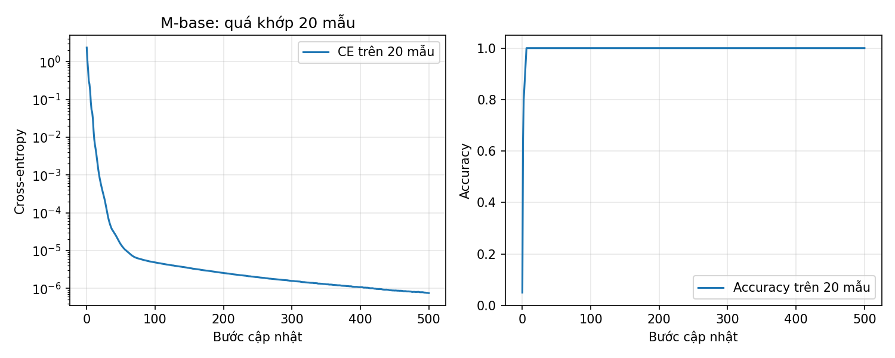
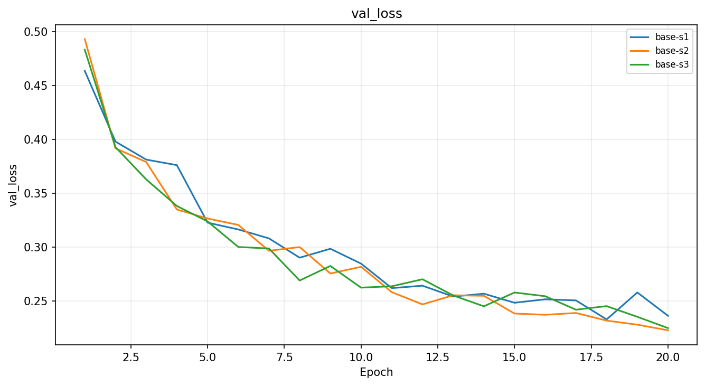
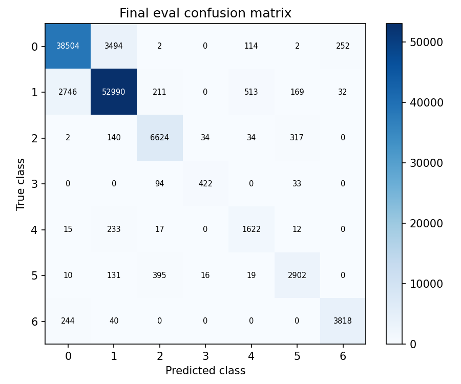

# Báo cáo Lab Day 1 — Nguyễn Đức Anh — 2A202602625

## 1. Thiết lập

Môi trường: {'torch': '2.11.0+cu130', 'device': 'cuda:0', 'gpu': 'Tesla T4'}. Forest CoverType: train gốc 464 809, eval 116 203; validation phân tầng 20%, seed 42: train 371 847, val 92 962. Chỉ chuẩn hoá 10 cột liên tục bằng train.
Baseline M-base 54→256→128→7, 47 879 tham số; CE, SGD momentum 0.9, lr=0.1, batch=512, 20 epoch, He, dropout=0, FP32. Train-loss đo eval mode trên tập con cố định 50,000 mẫu, val-loss trên toàn bộ val. Thời gian gồm train và đo metric, loại I/O checkpoint/vẽ.

## 2. Kiểm tra ban đầu và độ nhiễu

Part 1: 47,879 tham số, logits (8,7); val CE bước 0=2.377572, ln7=1.945910, lệch=+0.431662. Logits std=0.647230; He tạo điểm số chưa đều nên không ép CE về ln7. Chuẩn hoá đã được kiểm tra ở Part 0.
20 mẫu: CE 2.345478 → 0.00000075, accuracy 100%; 6 tham số có gradient >0. Đây là phép thử ghi nhớ, chưa chứng minh tổng quát hoá.

Baseline: 3 seed, base-s1, base-s2, base-s3.
- val_acc: 0.9097 ± 0.0024 (std mẫu).
- val_macro_f1: 0.8543 ± 0.0119 (std mẫu).
Ngưỡng nhiễu 2σ val-F1: 0.02378752530623858. Các so sánh dùng seed 1; ứng viên mới chưa được chạy nhiều seed nên kết luận vượt nhiễu vẫn có hạn chế.
Baseline val accuracy=0.9069 so mốc đoán đa số ≈0.4876. Best epoch=18; train-loss cuối=0.2177, val-loss cuối=0.2365. Val-loss giảm từ 0.4634 xuống 0.2365, đạt thấp nhất 0.2332 ở epoch 18; epoch 19 tăng lên 0.2581 rồi giảm lại. Chưa có xu hướng val-loss tăng kéo dài để kết luận quá khớp mạnh. Train-loss giảm từ 0.4633 xuống 0.2177, gap cuối 0.0188.

## 3. Kết quả theo chủ đề

### loss

Dự đoán trước: MSE trên logits và one-hot có thang đo/gradient khác CE. So accuracy và macro-F1, không so loss trực tiếp; chưa giả định MSE kém hơn khi chưa đo.

- `loss-mse`: best epoch 20, val F1=0.7259, accuracy=0.8699, ΔF1 so base-s1=-0.1151. |Δ| vượt 2σ=0.0238; đây là mốc tham khảo nhiễu baseline, chưa là kiểm định thống kê của cấu hình mới. lr=0.1; time/epoch=1.48s; peak GPU=202.69775390625 MiB.

MSE ở đây là mean((logits−one_hot)^2) trên B×7, không hệ số 1/2 và không softmax. Vì không dùng MSE trên xác suất, không suy luận bão hoà softmax từ lượt này; so F1/accuracy và tốc độ, không so trị số CE với MSE.
Ảnh: [so sánh loss](figures/compare_loss.png); ảnh từng exp_id nằm trong figures/ và tên tương ứng ở bảng.

### optimizer

Dự đoán trước: Momentum tích luỹ hướng gradient; Adam/AdamW điều chỉnh bước theo moment. Mỗi optimizer được thử ít nhất hai lr trước khi so tại lr tốt nhất; wd=0 cho phép kiểm tra Adam và AdamW có trùng nhau không.

- `opt-adam-lr0.001`: best epoch 20, val F1=0.8476, accuracy=0.9014, ΔF1 so base-s1=+0.0067. |Δ| không vượt 2σ=0.0238; đây là mốc tham khảo nhiễu baseline, chưa là kiểm định thống kê của cấu hình mới. lr=0.001; time/epoch=1.56s; peak GPU=202.87744140625 MiB.
- `opt-adamw-lr0.001`: best epoch 20, val F1=0.8476, accuracy=0.9014, ΔF1 so base-s1=+0.0067. |Δ| không vượt 2σ=0.0238; đây là mốc tham khảo nhiễu baseline, chưa là kiểm định thống kê của cấu hình mới. lr=0.001; time/epoch=1.55s; peak GPU=202.87744140625 MiB.
- `opt-sgd-lr0.1`: best epoch 18, val F1=0.7531, accuracy=0.8568, ΔF1 so base-s1=-0.0878. |Δ| vượt 2σ=0.0238; đây là mốc tham khảo nhiễu baseline, chưa là kiểm định thống kê của cấu hình mới. lr=0.1; time/epoch=1.36s; peak GPU=202.51123046875 MiB.
- `base-s1`: best epoch 18, val F1=0.8410, accuracy=0.9069, ΔF1 so base-s1=+0.0000. |Δ| không vượt 2σ=0.0238; đây là mốc tham khảo nhiễu baseline, chưa là kiểm định thống kê của cấu hình mới. lr=0.1; time/epoch=1.39s; peak GPU=202.6943359375 MiB.

Momentum tích luỹ hướng cập nhật; Adam/AdamW chia theo moment bậc hai. wd=0 khiến Adam và AdamW tương đương về công thức; khác biệt lớn ở cặp cùng lr/seed cần kiểm tra. SGDM có baseline và hai lr bổ sung chạy đủ epoch, các optimizer được so ở lr tốt nhất trong grid.
Ảnh: [so sánh optimizer](figures/compare_optimizer.png); ảnh từng exp_id nằm trong figures/ và tên tương ứng ở bảng.

### hparam

Dự đoán trước: M-wide có thể khớp tốt hơn nhưng tốn thời gian/bộ nhớ. Chỉ đổi hidden; cùng batch và epoch nên số bước cập nhật bằng baseline.

- `hparam-wide`: best epoch 20, val F1=0.8756, accuracy=0.9207, ΔF1 so base-s1=+0.0346. |Δ| vượt 2σ=0.0238; đây là mốc tham khảo nhiễu baseline, chưa là kiểm định thống kê của cấu hình mới. lr=0.1; time/epoch=1.43s; peak GPU=219.9794921875 MiB.

M-wide tăng số tham số lên 161 287. Cùng batch/epoch giữ số bước cập nhật bằng baseline; tăng năng lực không đảm bảo cải thiện nếu mô hình chưa được huấn luyện đủ.
Ảnh: [so sánh hparam](figures/compare_hparam.png); ảnh từng exp_id nằm trong figures/ và tên tương ứng ở bảng.

### dropout

Dự đoán trước: q=0.3 có thể giảm khoảng cách train-val nếu đã quá khớp; có thể làm chậm học khi cả train và val còn cao. Train loss phải đo với dropout tắt.

- `drop-0.3`: best epoch 20, val F1=0.7853, accuracy=0.8715, ΔF1 so base-s1=-0.0557. |Δ| vượt 2σ=0.0238; đây là mốc tham khảo nhiễu baseline, chưa là kiểm định thống kê của cấu hình mới. lr=0.1; time/epoch=1.52s; peak GPU=202.681640625 MiB. gap val−train cuối=+0.0034.

Dropout là chính quy hoá; có thể giảm quá khớp nhưng làm chậm học khi train và val còn cao. Các loss đều đo eval mode để so được.
Ảnh: [so sánh dropout](figures/compare_dropout.png); ảnh từng exp_id nằm trong figures/ và tên tương ứng ở bảng.

### clipping

Dự đoán trước: Ngưỡng c lấy bằng 0.5 lần median chuẩn gradient trung bình theo epoch baseline. Clipping có thể giảm gai ở lr cao, nhưng không đảm bảo cứu mọi lr; phải đo clip_fraction thực tế.

- `clip-base`: best epoch 18, val F1=0.8255, accuracy=0.8971, ΔF1 so base-s1=-0.0155. |Δ| không vượt 2σ=0.0238; đây là mốc tham khảo nhiễu baseline, chưa là kiểm định thống kê của cấu hình mới. lr=0.1; time/epoch=1.65s; peak GPU=202.681640625 MiB. clip_fraction=1.000.
- `clip-highlr-none`: best epoch 19, val F1=0.7804, accuracy=0.8695, ΔF1 so base-s1=-0.0606. |Δ| vượt 2σ=0.0238; đây là mốc tham khảo nhiễu baseline, chưa là kiểm định thống kê của cấu hình mới. lr=1.0; time/epoch=1.42s; peak GPU=202.681640625 MiB. clip_fraction=0.000.
- `clip-highlr-on`: best epoch 20, val F1=0.8223, accuracy=0.8879, ΔF1 so base-s1=-0.0187. |Δ| không vượt 2σ=0.0238; đây là mốc tham khảo nhiễu baseline, chưa là kiểm định thống kê của cấu hình mới. lr=1.0; time/epoch=1.67s; peak GPU=202.681640625 MiB. clip_fraction=0.159.

Cắt chuẩn L2 toàn cục trước update; ở lr cao phải so cặp cùng lr. Clip chỉ có tác dụng khi chuẩn vượt c; clip_fraction là bằng chứng trực tiếp.
Ảnh: [so sánh clipping](figures/compare_clipping.png); ảnh từng exp_id nằm trong figures/ và tên tương ứng ở bảng.

### amp

Dự đoán trước: FP16/BF16 có thể giảm bộ nhớ và thời gian nhưng mạng nhỏ có thể bị chi phí kernel/synchronization chi phối. FP16 cần GradScaler vì khoảng biểu diễn hẹp; BF16 có khoảng gần FP32 nên không dùng scaler.

- `amp-fp16`: best epoch 18, val F1=0.8457, accuracy=0.9057, ΔF1 so base-s1=+0.0047. |Δ| không vượt 2σ=0.0238; đây là mốc tham khảo nhiễu baseline, chưa là kiểm định thống kê của cấu hình mới. lr=0.1; time/epoch=1.88s; peak GPU=202.6826171875 MiB.
- `amp-bf16`: best epoch 18, val F1=0.8366, accuracy=0.9056, ΔF1 so base-s1=-0.0044. |Δ| không vượt 2σ=0.0238; đây là mốc tham khảo nhiễu baseline, chưa là kiểm định thống kê của cấu hình mới. lr=0.1; time/epoch=1.63s; peak GPU=202.681640625 MiB.

FP16 có miền biểu diễn hẹp, GradScaler tăng loss và unscale trước đo/clip; overflow làm bỏ bước và giảm scale. BF16 có số bit exponent như FP32, thường không cần scaler. Chỉ gọi nhanh hơn nếu thời gian đo cho thấy; mạng nhỏ có thể bị chi phí kernel/I/O đồng bộ chi phối.
Ảnh: [so sánh amp](figures/compare_amp.png); ảnh từng exp_id nằm trong figures/ và tên tương ứng ở bảng.

### init

Dự đoán trước: Zeros giữ đối xứng và ReLU(0) làm gradient lớp ẩn bằng 0; mạng chủ yếu học bias đầu ra. Normal std 0.01 dễ làm kích hoạt nhỏ; Xavier dùng Var=2/(fan_in+fan_out), He dùng 2/fan_in.

- `init-zeros`: best epoch 10, val F1=0.0936, accuracy=0.4876, ΔF1 so base-s1=-0.7473. |Δ| vượt 2σ=0.0238; đây là mốc tham khảo nhiễu baseline, chưa là kiểm định thống kê của cấu hình mới. lr=0.1; time/epoch=1.42s; peak GPU=202.681640625 MiB. step0=1.9459, std sau Linear=[0.0, 0.0, 0.0].
- `init-normal`: best epoch 20, val F1=0.8518, accuracy=0.9049, ΔF1 so base-s1=+0.0108. |Δ| không vượt 2σ=0.0238; đây là mốc tham khảo nhiễu baseline, chưa là kiểm định thống kê của cấu hình mới. lr=0.1; time/epoch=1.39s; peak GPU=202.681640625 MiB. step0=1.9460, std sau Linear=[0.034341491758823395, 0.003764528315514326, 0.00027149778907187283].
- `init-xavier`: best epoch 17, val F1=0.8374, accuracy=0.9025, ΔF1 so base-s1=-0.0036. |Δ| không vượt 2σ=0.0238; đây là mốc tham khảo nhiễu baseline, chưa là kiểm định thống kê của cấu hình mới. lr=0.1; time/epoch=1.42s; peak GPU=202.681640625 MiB. step0=2.0222, std sau Linear=[0.2758374810218811, 0.21821977198123932, 0.19155699014663696].

He: Var=2/fan_in; Xavier_normal: Var=2/(fan_in+fan_out). Zeros không phá đối xứng, ReLU tại 0 chặn gradient lớp ẩn, chỉ bias cuối có thể học phân bố lớp. Mạng 3 Linear chưa đủ sâu để kết luận về mạng 30 lớp.
Ảnh: [so sánh init](figures/compare_init.png); ảnh từng exp_id nằm trong figures/ và tên tương ứng ở bảng.

### Đối chiếu dự đoán với kết quả thực đo

**Loss và optimizer.** MSE đạt F1 0.7259, thấp hơn CE 0.1151 trên cùng seed; phù hợp với việc hai hàm mất mát có mục tiêu và thang gradient khác nhau. Không so trực tiếp trị số loss của chúng. Trong grid đã thử, SGD tốt nhất (lr 0.1) đạt 0.7531, SGDM đạt 0.8410; momentum có lợi ở thiết lập này. Adam và AdamW tốt nhất (lr 0.001) cùng đạt 0.8476, chỉ hơn baseline 0.0067, dưới mốc nhiễu 0.0238. Hai optimizer trùng kết quả khi weight_decay=0 là điều dự kiến; chưa có bằng chứng Adam tốt hơn SGDM một cách ổn định. Tuning baseline chỉ dùng 3 epoch, chọn lr 0.1 từ {0.01, 0.03, 0.1}; không so F1 tuning với các lượt 20 epoch.

**Độ rộng và dropout.** M-wide đạt F1 0.8756, hơn base-s1 0.0346, vượt mốc 2σ baseline. So với trung bình ba seed baseline 0.8543, mức tăng chỉ 0.0213; M-wide mới chạy một seed nên vẫn cần thận trọng. Cùng 20 epoch và batch 512, mỗi lượt có 14 540 bước cập nhật. Thời gian/epoch tăng 1.3914 → 1.4254 giây (+2.44%); bộ nhớ tăng 202.69 → 219.98 MiB. Val-loss M-wide còn giảm đến epoch 20, train/val cuối 0.1750/0.2017; gap 0.0267 lớn hơn baseline nhưng chưa biểu hiện val-loss tăng kéo dài. Dropout 0.3 giảm gap xuống 0.0034 nhưng F1 giảm còn 0.7853, train-loss 0.3122: trong ngân sách này dropout làm mô hình khớp chậm hơn/thiếu khớp, không cải thiện tổng quát hoá.

**Clipping.** Ngưỡng c=0.28343 lấy từ trung vị chuẩn gradient trung bình từng epoch của baseline. Ở lr 0.1, clipping kích hoạt 99.99% bước và F1 giảm còn 0.8255 (chênh -0.0155 dưới mốc nhiễu), gợi ý ngưỡng khá chặt. Stress lr=1 vẫn có loss hữu hạn khi không clip: không quan sát NaN hay một ca divergence được cứu. Clipping giảm cực đại gradient trước clip 9.7017 → 2.8437, kích hoạt 15.89% bước và cải thiện F1 0.7804 → 0.8223. Chênh 0.0419 vượt mốc tham khảo, nhưng chưa có lặp nhiều seed cho cặp stress này; stress bị loại khi chọn final.

**AMP.** FP16 mất 1.8844 giây/epoch (+35.43% so FP32), BF16 mất 1.6329 (+17.35%); bộ nhớ cả hai khoảng 202.68 MiB, gần baseline. F1 tương ứng 0.8457 và 0.8366, chênh so baseline dưới mốc nhiễu; FP16 có 3 cập nhật bị GradScaler bỏ qua, BF16 không có. Kết quả trái với kỳ vọng AMP luôn tăng tốc: MLP nhỏ và chi phí autocast/đo metric có thể lấn lợi ích tính toán; đây là diễn giải, chưa đo profiling. BF16 đã chạy và được giữ làm bằng chứng, nhưng T4 có compute capability 7.5 và không có phép toán BF16 phần cứng như nhóm 8.x. PyTorch 2.11 mặc định kiểm tra BF16 với `including_emulation=True`, nên thông báo hỗ trợ không chứng minh tăng tốc BF16 bản địa. [Nguồn PyTorch](https://github.com/pytorch/pytorch/blob/v2.11.0/torch/cuda/__init__.py), [GPU NVIDIA](https://developer.nvidia.com/cuda/gpus), [bảng khả năng tính toán](https://docs.nvidia.com/cuda/cuda-programming-guide/05-appendices/compute-capabilities.html).

**Khởi tạo.** Zeros đúng dự đoán thất bại: F1 0.0936, accuracy 0.4876; loss vẫn giảm từ ln7 xuống 1.2052 vì bias đầu ra học prior lớp, không phải toàn mạng bất động. Normal nhỏ có độ lệch chuẩn giảm 0.03434 → 0.00376 → 0.00027 qua ba Linear nhưng cuối cùng đạt F1 0.8518, hơn He 0.0108 dưới mốc nhiễu. Vì vậy dự đoán thiếu tín hiệu ban đầu không đồng nghĩa thất bại sau 20 epoch. Xavier đạt 0.8374, gần He; mạng này chưa cung cấp bằng chứng He luôn tốt hơn mọi khởi tạo.

## 4. Đánh giá cuối trên eval

Đã chốt selection.json bằng val trước khi gọi script gốc.

| Model | exp_id | val F1 | eval F1 | eval accuracy |
|---|---|---:|---:|---:|
| Baseline | base-s1 | 0.8410 | 0.8427 | 0.9043 |
| Final | hparam-wide | 0.8756 | 0.8763 | 0.9198 |

Cải thiện eval-F1=+0.0335; final val−eval F1=-0.0007. Chỉ đo nhiễu trên val, chưa đo nhiễu eval, nên chưa kết luận ý nghĩa thống kê của cải thiện eval.

| Lớp | support | precision | recall | F1 |
|---|---:|---:|---:|---:|
| 0 | 42368 | 0.9273 | 0.9088 | 0.9180 |
| 1 | 56661 | 0.9292 | 0.9352 | 0.9322 |
| 2 | 7151 | 0.9021 | 0.9263 | 0.9140 |
| 3 | 549 | 0.8941 | 0.7687 | 0.8266 |
| 4 | 1899 | 0.7046 | 0.8541 | 0.7722 |
| 5 | 3473 | 0.8448 | 0.8356 | 0.8402 |
| 6 | 4102 | 0.9308 | 0.9308 | 0.9308 |

Lớp khó nhất: 4, F1=0.7722, support=1899; recall tăng từ 0.6251 của baseline lên 0.8541 nhưng precision giảm từ 0.8485 xuống 0.7046. Có 513 mẫu lớp 1 bị dự đoán thành lớp 4; nhầm nhiều nhất sang 1 (233 mẫu). Mất cân bằng có thể là một nguyên nhân; tương đồng đặc trưng cần phân tích thêm, chưa được chứng minh bởi ma trận nhầm lẫn.

## 5. Câu hỏi dẫn dắt và hạn chế

Khi loss không giảm sau 2 000 bước: (1) đo loss bước 0 và logits để kiểm tra nhãn/chuẩn hoá/khởi tạo; (2) thử ghi nhớ 20 mẫu với dropout tắt để kiểm tra vòng cập nhật; (3) kiểm tra gradient từng tham số sau backward, zero_grad và danh sách optimizer.
Chưa đo nhiễu của mọi cấu hình; lr grid nhỏ, tuning baseline ngắn, cùng số epoch không đảm bảo cùng độ hội tụ. So thời gian AMP chỉ hợp lệ trên cùng GPU/runtime. Các giải thích cơ chế là cơ sở diễn giải, chưa chứng minh quan hệ nhân quả bằng riêng một seed.

## 6. Phụ lục

Số đo đầy đủ: experiments.xlsx, results/*.json; ảnh riêng figures/<exp_id>.png. Đã nhập notebook Colab có output vào code/lab.ipynb, kiểm tra không có cell báo lỗi và chấm lại hai CSV bằng evaluator gốc. Gói nộp không chứa dữ liệu hoặc checkpoint.
